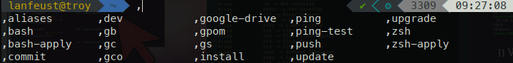

# [Tips] **Efficient linux aliases setup** <!-- omit in toc -->

5 *min setup*



- [1. Use a remote repository](#1-use-a-remote-repository)
  - [Storing aliases online](#storing-aliases-online)
  - [Download them to a new device - takes 3s every new device](#download-them-to-a-new-device---takes-3s-every-new-device)
- [2. Tip: Start your aliases with a comma](#2-tip-start-your-aliases-with-a-comma)
- [3. One alias to rule them all](#3-one-alias-to-rule-them-all)
  - [Usual use : see, change, update your aliases - takes 2 seconds every update](#usual-use--see-change-update-your-aliases---takes-2-seconds-every-update)
  - [More details](#more-details)
- [Thank you !](#thank-you)

Setting aliases for commands is a very good way to save time at work. But setting them up always takes time -far more than it should! Moreover, you lose them all if you have to ssh on a server or change device. **Time to change this by building a very easy setup!**

You will see how to

- access your aliases **everywhere**
- create an **efficient** aliases system -with a *weird trick*
- easily **manage** aliases for everyday use and update

## 1. Use a remote repository

The main goal is to make your aliases available on every device you're connecting, so using a centralized system is recommended in this situation.

### Storing aliases online

As we are using a single file, you can use [Github Gists](https://gist.github.com/).
You can download my template with useful commands [here](https://gist.github.com/EwenQuim/b3ba203bdacb17bc1a15815cbc58792d) or create your own and clone it to your computer.
I suggest you to fork my file, so you can create you own aliases without depending on mine, and still begin the setup easily.

It will behave like a git repository, excepted it's for a single file.

### Download them to a new device - takes 3s every new device

Now that you have you aliases stored online, learn how to use them on your devices !
Every time you create a new VM, set up a new raspberry pi or connect to a new server, just run this (don't forget to replace with *your* gist id and username if you have fork my gist!):

```bash
mkdir ~/.tools && cd $_
git clone https://gist.github.com/EwenQuim/b3ba203bdacb17bc1a15815cbc58792d.git .
source .aliases
echo "source ~/.tools/.aliases" >> ~/.bashrc
```

Change .bashrc to .zshrc if you use zsh, of course.

But there are some issues : we **can't update** easily the list of aliases ! And it's **not very handy**... Do you like typing `nano ~/.bashrc` and then `source ~/.bashrc` every time you just want to change a simple alias ?

The system is not fully efficient here, so we'll se how to improve it in [part 3](#3-one-alias-to-rule-them-all).
But before that, look at this **weird trick** in [part 2](#2-tip-start-your-aliases-with-a-comma).

## 2. Tip: Start your aliases with a comma

*Why this monstrosity ? I've never seen a command beginning with a comma !*

Absolutely, and that's why we will do this. It allows two things:

- Avoid collisions with existing commands
- Display your custom commands easily

As explained in this old but useful [article](https://rhodesmill.org/brandon/2009/commands-with-comma/), this little known trick allows to display every custom command/alias by typing the comma then typing `tab`.
It looks like this:


Also, the comma is **easy to type** : it's a lowercase character, does not require weird combination of keys, exists on all keyboards...

Trust me, that's not *that* odd to do so ;)

## 3. One alias to rule them all

### Usual use : see, change, update your aliases - takes 2 seconds every update

If you have forked my gist in [1](#1-use-a-remote-repository) :
Just type `,aliases`. Easy, isn't it?

### More details

The command `,aliases` looks like this (already included in my gist in case you download/fork it).

```bash
alias ,aliases="cd ~.tools/ && git pull && nano .aliases && source .aliases && git commit -a -v && git push origin master && cd -"
```

When you type `,aliases`, this happens:

- download latest changes you've put online
- see your aliases in nano
- you can edit them
- if it was edited, it will put everything online

This takes seconds, and is very handy to use.

## Thank you !

Don't hesitate to remove the `-S` option in the commit alias if you don't PGP sign your commits (I'll explain later why you should -and it's easy too!)

I hope it will be useful for you !
