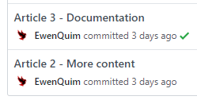
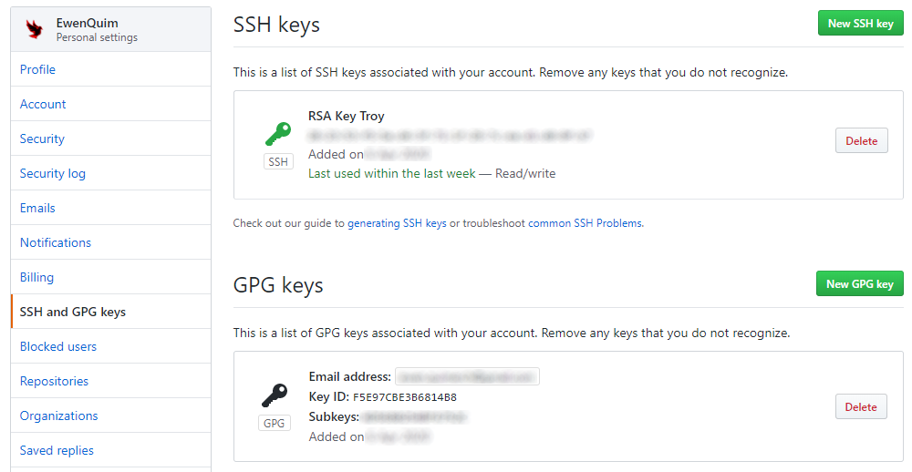
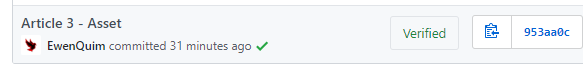

# **[Crypto]** Sign your commits with PGP <!-- omit in toc -->

10 *min setup*

- [1. What is PGP](#1-what-is-pgp)
  - [Quick Definition](#quick-definition)
  - [More about PGP - History and Challenges](#more-about-pgp---history-and-challenges)
  - [Setting up PGP](#setting-up-pgp)
- [2. Use PGP in Git](#2-use-pgp-in-git)
  - [Why you must sign your work](#why-you-must-sign-your-work)
  - [How can I do this](#how-can-i-do-this)
  - [Warnings](#warnings)
- [References](#references)

Git history can be modified. **Time to protect your project!**

In this article, you will see:

- an overview of PGP
- **quick PGP setup**
- git **signing procedure** with PGP
- **vscode** integration

## 1. What is PGP

### Quick Definition

**PGP** (Pretty Good Privacy) is a encryption program, used for encrypting, decrypting and signing emails and documents.
It is as far as we know one of the *best encryption algorithm*.

### More about PGP - History and Challenges

**PGP** is often used in communication and especially mail exchange: [Mailvelope](https://www.mailvelope.com) and [Enigmail](https://enigmail.net) extensions allows you to integrate PGP encryption into your mails. PGP is also useful for a lot of other situations where security is required.

The original program is a proprietary software, but there exists free version of it, [GnuPG](https://www.gnupg.org/)[^gnupg] (referred as GPG), that follows the [OpenPGP](https://www.openpgp.org/)[^openpgp] standard.

The name *Pretty Good Privacy* really is an euphemism, as the security ensured by this algorithm is **almost unbreakable**. Flaws were discovered not in PGP itself but in emails clients[^flaw] for example. Also, it is easier for the police to make a suspect say their passphrase[^1] [^2] or directly infect his computer[^3] (and then inspecting keystrokes to get the passphrase) than attacking the algorithm itself... The problems always revolved around PGP but not the strong algorithm.

You may ask *'Why do I need PGP? I don't need this much privacy!'*

This is what Philip Zimmermann, creator of PGP, said:

> If privacy is outlawed, only outlaws will have privacy. Intelligence agencies have access to good cryptographic technology. So do the big arms and drug traffickers. So do defense contractors, oil companies, and other corporate giants. But ordinary people and grassroots political organizations mostly have not had access to affordable military grade public-key cryptographic technology. Until now.
>
> PGP empowers people to take their privacy into their own hands. There's a growing social need for it. That's why I wrote it.

The PGP was not made for outlaws. Like [Tor](https://www.torproject.org/)[^tor], it was conceived to protect everyone's privacy. Because outlaws will always find a way to protect themselves, whereas the general public is weak in dealing with these technically complex concerns.

Why isn't it better known to the general public? There are some reasons I imagine:

- Complicated use (even if we will see easy ways to approach PGP)
- No promotion...
- ...or even discourage by some governments
- Rising use of mobile devices, not very PGP-friendly (even if there are some projects integrating PGP for Android[^openkeychain] and Apple[^pgpeverywhere])
- No benefits for GAFAM (since it contradicts their business models)

### Setting up PGP

Linux enthusiasts often use GnuPG[^gnupg] (referred as GPG), but we will use [this website](https://www.thechiefmeat.com/pgp/#) for this tutorial, as the interface is really intuitive.

Just fill in the blanks and the website will provide you 2 keys : a **public key** and a **private (or secret) key**. If you are afraid that someone watching the website steals your private key, you can use Tor[^tor] to access the website and/or cut your internet connexion during the key generation.

To sum up quickly in which situation you will use the **private key** and the **secret key**:

- if *you* sign something:
  - your secret key *(you are the only one to know it)*
- if *others* want to verify something signed by *you*:
  - your public key *(public so anyone can verify that you really are the author)*
- if *you* encrypt something to send to *someone*:
  - your secret key
  - the public key of the receiver *(so only the receiver can read it)*
- if *you* want to decrypt something that *someone* sent to you
  - the public key of the sender *(to decrypt his message)*
  - your secret key

It makes sense, doesn't it? Just try it with a friend!

[Go to the website](https://www.thechiefmeat.com/pgp/)

You can also try to send me an encrypted message (if you know how to contact me of course!). You can find my public PGP key [here](../documents/pgp-public-key.md).

You can use any message service, as the message is encrypted! Don't foret to send me your public PGP key if you want me to answer ;)

## 2. Use PGP in Git

### Why you must sign your work

Remember the first time you used git in your computer.
You have typed these instruction :

```bash
git config --global user.name "Chuck Norris"
git config --global user.email chuck.norris@example.com  
```

Git remembers what you filled and indicates your name and email for every commit.



You know that git allows you to navigate through the history and modify older commits. What you probably don't know is that you can even modify the metadata (eg. the date or the author)!

Some funny guys even made a CLI to [blame someone else](https://github.com/jayphelps/git-blame-someone-else) for your bad code, or [claim some work you didn't do](https://github.com/SilasX/git-upstage).

If you work seriously, for example on an open-source project, this can be quite scary, and you may want to protect your git history.

Luckily, git allows you to sign your work with PGP !

### How can I do this

Once you created your PGP key, add it to git (locally) with the following command:

```bash
git config --global user.signingkey your-public-PGP-key-fingerprint-here
```

Then, every time you commit, just add `-s` to `git commit`, and there it is! You just made your first PGP-signed commit.

You can go further by creating [custom aliases](2-linux-aliases.html) to make this operation transparent, and not losing time.

If you commit from a graphical interface, it is also possible to sign your commits!

For example, if you use Visual Studio Code, just go to the settings, type `git sign` and activate the option.

It is also important to add your public PGP key to your remote repository, so the git host can verify them (often represented with a nice green tick on your history).

Here the example on Github (it's similar on Gitlab):

Insert your PGP key here



And here is the result : a 'verified' mention on your git history!



### Warnings

Beware of where you are committing something. Your signature depends on the PGP keys available on the device you use. Don't forget to copy your PGP key and link it to git when you use a new device.

Especially, it is highly not recommended to sign a commit from a server. Because it would mean that either it wouldn't be signed, or that you have your PGP key on the server...

You shouldn't commit on a prod server anyway, whether you sign it or not.

→ [All articles](../articles.md)

## References

[^gnupg]: <https://www.gnupg.org/>
[^openpgp]: <https://www.openpgp.org/>
[^flaw]: <https://efail.de/#is-my>
[^1]: <https://en.wikipedia.org/wiki/In_re_Boucher>
[^2]: <http://volokh.com/files/BoucherDCT.1.pdf>
[^3]: <https://www.cnet.com/news/feds-use-keylogger-to-thwart-pgp-hushmail/>
[^tor]: <https://www.torproject.org/>
[^openkeychain]: <https://www.openkeychain.org/>
[^pgpeverywhere]: <https://www.pgpeverywhere.com/>
