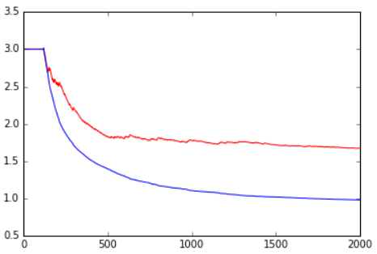
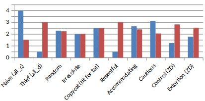
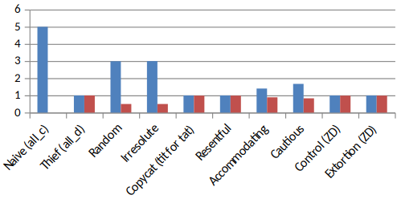
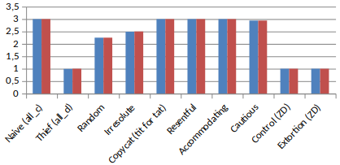
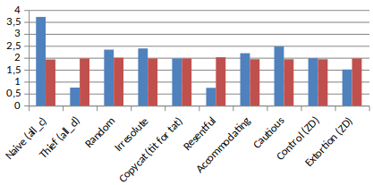
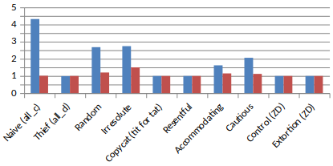
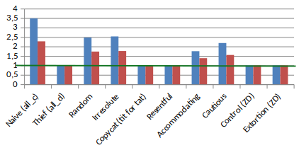
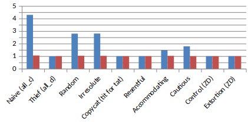
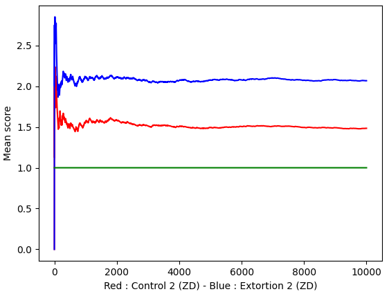

# **[Maths]** Control the opponent in some games <!-- omit in toc -->

20 *min read*

10 *min testing (if you want to)*

- [1. Prisoner's dilemma](#1-prisoners-dilemma)
  - [The story](#the-story)
  - [Representing games](#representing-games)
  - [Equilibria](#equilibria)
  - [The paradox](#the-paradox)
- [2. Iterated Prisoner's dilemma](#2-iterated-prisoners-dilemma)
  - [New behaviors](#new-behaviors)
  - [New strategies](#new-strategies)
  - [Let's fight!](#lets-fight)
- [3. Optimized Strategies](#3-optimized-strategies)
  - [Control](#control)
  - [Extorsion](#extorsion)
  - [Extorsion vs. control](#extorsion-vs-control)
  - [The winning strategy!](#the-winning-strategy)
- [4. Real life application](#4-real-life-application)
- [5. Appendix: Real maths. Proofs.](#5-appendix-real-maths-proofs)
  - [Game in normal form](#game-in-normal-form)
  - [Prisoner's dilemma generalized](#prisoners-dilemma-generalized)
  - [Strategies: general form](#strategies-general-form)
  - [Press and Dyson's work](#press-and-dysons-work)
- [References](#references)

A quick article about how to **control opponent's score in some games**, with the help of a nice part of mathematics called *Game Theory*.

This article is derived from [this paper](https://www.pnas.org/content/109/26/10409)[^1] from mathematicians Press & Dyson. The original work isn't very understandable for everyone, so I decided to work on it and publish it with very simple formulas and illustrations so **everybody can understand**!

After reading this article, you may want to **try your own strategies** with [these ressources](https://github.com/EwenQuim/iterated-prisoners-dilemma)[^try].

In this article, you will see:

- Basics of Game Theory
- The Prisoner's Dilemma and its Iterated version
- Winning strategies

## 1. Prisoner's dilemma

### The story

You stole the bank with your partner in crime. You just had the time to hide the money when the sirens sound. You see the police coming and you run. Too late: the police is here! You fight with a policeman while trying to escape, but they manage to arrest you anyway. You are now at the police station. But they do not have any evidence that *you two* are the thieves!

A clever policeman takes you aside and says

> Here's the deal: you will decide the fate of your friend. You have two choices.
> 
> - If you lie and protect him, we will sue you for fighting with the police? You'll get 1 year in prison.
> 
> - But if you betray him, you're immediately free and he gets the maximal sentence: in jail for 10 years!
> 
> Of course, it's the same deal for your partner...
> If you betray each other, you'll have 5 years each.

The prisoner thinks a few minute.

> If my friend betrays me, I better have to betray him too: I'll go to prison 5 years instead of 10.
> 
> If he lies and protect me, I should betray too, because I'll never go to prison, instead of wasting my life during 1 year...
> 
> In any case, it's better to betray.
> If he thinks the same, I have no reason to cooperate.

At the end, they both betray each other and go to prison 5 years, whereas they could have cooperated and go to prison only 1 year...

That is the prisoner's dilemma.

### Representing games

The prisoner's dilemma is one of the fundamentals of Game Theory.

As every game in "normal form", it's described by 3 things ([see more about this here](#game-in-normal-form)):

- Players
- Strategies for each player. It can be anything: {heads, tails} or {bet 1\$, bet 5\$, bet 10\$}
- Utility function: it maps every situation (strategies of every player) to a gain (or a loss)

A 2-players game with finite strategies is often represented as a mere table. So it sums up like this for example:

|  X \ Y |   Ace   |  Queen  |
|:------:|:-------:|:-------:|
|**King**| (-1, 1) | (1, -1) |
| **10** | (-3, 3) | (-1, 1) |
|  **9** | (-6, 4) | (-2, 5) |

In this game, if X plays a 10 and Y plays the Ace, Y will get 3 points and X will lose 3 points. The mean value of utility for X is -2, his cards aren't good!

In Game Theory, the utility (the gain function) can be anything too. It can be expressed in euros, happiness, pastries, or a mix of all three!

*What about the prisoner's dilemma?*

It's a 2 players (X and Y) game with 2 strategies each: Cooperate (C) or Defect (D).

|     X \ Y     | Cooperate | Defect |
|:-------------:|:---------:|:------:|
| **Cooperate** |   (3, 3)  | (0, 5) |
|    **Defect** |   (5, 0)  | (1, 1) |

Here we took the opposite situation described in the little story. It looks more like a loot sharing situation.

The numbers (0, 1, 3, 5) [can change](#prisoners-dilemma-generalized), but it is a classical example.

### Equilibria

The main goal of Game Theory in to find equilibria: these are special situations that allows one to guess what to do.

One of the most well-known is the **Nash Equilibrium**: it is a situation where no player can strictly benefit from deviating to another strategy, knowing that the others play according to the given situation.
For the prisoner's dilemma, it's the strategy {D, D} (that lead to a utility of 1 to everyone) : as exposed in the story, a player which is rational have no reason to change its strategy and cooperate, as it leads to a smaller utility!

Another Equilibrium is the **Pareto Optimum**. It is a situation where you can't increase the utility of a player (by changing its strategy) without reducing the utility of another player. The strategies {C, C}, {C, D} and {D, C} are Pareto Optimums. For example, from {C, C} to increase the utility of player X, he can only do that by reducing the utility of Y.

### The paradox

The 'paradox' can be summarized in one sentence:

> In the Prisoner's Dilemma game, none of Nash Equilibria are Pareto Optimums.

The only Nash Equilibrium is the situation {D, D}.
And it isn't a Pareto Optimum: if both players cooperate, they can simultaneously increase their gain! But since it is a Nash equilibrium, neither player has any interest in doing that. Playing both Cooperate is sub-optimal as a player could easily betray to increase his winnings!

The strategy Cooperate is said "dominated" by the strategy "Defect", because whatever the opponent do, it is always better to betray.

The situation {C, C} is called the "social optimum", as it is the highest total utility. But it will never be played.

*But what if the two players can talk to each other?*
There might be betrayals, it's just talk.

So what if they can't, but they can play repeatedly?

**Will it build trust or resentment?**

## 2. Iterated Prisoner's dilemma

### New behaviors

If one knows what the opponent have played during the last 50 rounds, it is more likely to know what to chose.

But it would induce very complicated algorithm to find the right strategy.

In fact, the mathematicians Press and Dyson have found that for infinite rounds (and it will work for an enough big number of rounds in practice) of the same game, it is enough to know the action of the previous round to make a good strategy.

So we will adapt our strategies to the actions of the previous round!

### New strategies

#### Pure strategies <!-- omit in toc -->

If we both cooperated, let's cooperate again.
If I cooperated but the opponent betrayed me, let's betray him next round.
If we betrayed him and he attempted to cooperate, let's betray him again, it works!
If we both betray, we'll try to both increase our gain by cooperating.

We just build the following strategy:

| X \ Y |     C     |     D     |
|:-----:|:---------:|:---------:|
| **C** | Cooperate |   Defect  |
| **D** |   Defect  | Cooperate |

We will simplify it as this:

| X \ Y | C | D |
|:-----:|:-:|:-:|
| **C** | 1 | 0 |
| **D** | 0 | 1 |

With 1 meaning 100% chance for X to cooperate the next round and 0 meaning 0% for X chance to cooperate the next round (100% chance of betrayal).

We can have other strategies:

*The naive*

| X \ Y | C | D |
|:-----:|:-:|:-:|
| **C** | 1 | 1 |
| **D** | 1 | 1 |

*The thief*

| X \ Y | C | D |
|:-----:|:-:|:-:|
| **C** | 0 | 0 |
| **D** | 0 | 0 |

*The copycat a.k.a tit-for-tat* (copies what the opponent played last turn)

| X \ Y | C | D |
|:-----:|:-:|:-:|
| **C** | 1 | 0 |
| **D** | 1 | 0 |

A lot of strategies exists[^2]!

#### Mixed strategies <!-- omit in toc -->

You can even randomize the chances to cooperate.

*The undecided* (0.5 meaning 50% chance to cooperate)

| X \ Y |  C  |  D  |
|:-----:|:---:|:---:|
| **C** | 0.5 | 0.5 |
| **D** | 0.5 | 0.5 |

*The cautious*

| X \ Y |  C   |  D  |
|:-----:|:----:|:---:|
| **C** | 0.99 | 0.5 |
| **D** | 0.9  | 0.1 |

You can invent your own!

We just need one thing more before comparing strategies: the initial situation! It doesn't depend on the "last round" because it's the first...

### Let's fight!

#### One vs one <!-- omit in toc -->

We will compare two strategies:

*The resentful*: betray him once, he will always betray!
He cooperates first.

| X \ Y | C | D |
|:-----:|:-:|:-:|
| **C** | 1 | 0 |
| **D** | 0 | 0 |

*The cautious*.
He cooperates first.

| X \ Y |  C   |  D  |
|:-----:|:----:|:---:|
| **C** | 0.99 | 0.5 |
| **D** | 0.9  | 0.1 |

Here's what happened when playing 2,000 rounds (blue for the *cautious* and red for the *resentful*)

The mean gain was 3 while they both cooperate, and then it breaks down when the cautious betrays for the first time (he had 1% chance to betray in the {C, C} situation).
Then, the resentful always betrayed, even when the cautious tried to cooperate. That's why the gain of the cautious went down to 1 (as the Nash Equilibrium {D, D} utility is 1). Sometimes the cautious attempt to cooperates and gets 0 while the resentful gets 5 by defecting.

There are even more graphs than strategies, so try it out with my script [just here](https://github.com/EwenQuim/iterated-prisoners-dilemma)!

#### One vs all <!-- omit in toc -->

Comparing 2 strategies at a time isn't very efficient. I entered all strategies in a database so I can choose a strategy and it displays the result for a given number of rounds against all the strategies (including itself).

Everything is [here](https://github.com/EwenQuim/iterated-prisoners-dilemma) again. Just create your own strategy and launch the script, everything will be computed automatically ;)

For example, we can see the results for the strategy

*The irresolute*

| X \ Y | C | D |
|:-----:|:-:|:-:|
| **C** | 1 | 0 |
| **D** | 0 | 0 |

against some other strategies, for 10,000 rounds.

It wins against some but loses against some...

#### All vs. all <!-- omit in toc -->

The mean score for a given strategies against all the other strategies doesn't mean anything because it relies on the other strategies (and it shouldn't matter).

A good thing that can be done is just counting the beaten strategies.

We can easily see that the thief wins every time, as it always play the dominent strategy.

But it isn't the strategy with the highest mean score: tit-for-tat have a much better score for example.

It is interesting to see that following this strategy will cause you to have the same score than the opponent at the end of the 10,000 rounds.

#### Conclusion <!-- omit in toc -->

There are no perfect strategies here. Maybe we have to find better ones, that allow to win with a high score *while* defeating the other!

I told you in the title that we can do better: **control the opponent's gain**.

## 3. Optimized Strategies

### Control

If you choose the right strategy, you can set the mean opponent's score to any value between 1 (the utility for the Nash equilibrium) and 5 (the maximal gain).

For example with *Control 2*, we set the opponent's score to 2!

| X \ Y |  C  |  D  |
|:-----:|:---:|:---:|
| **C** | 0.9 | 0.7 |
| **D** | 0.2 | 0.1 |

Why 0.9, 0.7, 0.2 and 0.1? How do we chose the right coefficients? The answer is quite complicated but you can find in in [part 5](#5-appendix-real-maths-proofs).

You can even set the opponent's score to 1, the minimum possible! (as it is the utility at the Nash equilibrium)

*Control 1*

| X \ Y |  C  |  D  |
|:-----:|:---:|:---:|
| **C** | 0.0 | 0.0 |
| **D** | 0.5 | 0.0 |

We can see some defects... in fact, the more you tend to 1, the more time it takes, and it seems 10,000 rounds isn't enough for some strategies to go to its limit.

What's incredible is that you can't control your own score by doing this. You will never be able to do that in Game Theory, because it is not interesting. It in not a strategy, but full control, and thus uninteresting.

However, it's **not satisfying enough**.

We don't want to control the opponent's score, we want to have better than him **every time**.

### Extorsion

Even if we can't control our own gain, it still is possible to control the ratio of our score to the opponent's.

*Extorsion 2* set our score two times higher than the opponent's!

| X \ Y |  C  |  D  |
|:-----:|:---:|:---:|
| **C** | 8/9 | 0.5 |
| **D** | 1/3 | 0.0 |

In fact, it is not really the score which is twice higher, but rather the part above 1 (the Nash Equilibrium)

If we are greedy, we can try to set the ratio to 100. But here's what happen:

In fact, 100*0=0. By trying to reduce the opponent's score to 0 (in fact, 1 as we saw), we are reducing our own score.

### Extorsion vs. control

We can makes these two incredible strategies fight each other.

They are compatible! *Control-2* set the *Extorsion*'s score to 2 and *Extorsion-2* makes sure that his score is twice the *Control*'s score.

### The winning strategy!

The **Extorsion** strategy will always have a better score than any of its opponents, or at least the same than them. To maximize the score, don't be too greedy at apply a factor 2 or 3 (remember that 100*0=0!)

## 4. Real life application

Wow. If you read  until here, you must wonder:

> What is it useful for? These strategies were nice, but I'll never play 10,000 prisoner's dilemma?

There are many games that can look as Prisoner's dilemma. Here's a short list:

- economic competition
- patent owning
- animal cooperation (bats for example must learn to cooperate sometimes and betray other times)
- couple life (each decision can be a dilemma according to your preferences, even if it is not always a big deal)

Remember that if you want to maximize you happiness, do not betray every time. But do not cooperate each time: think about yourself!

Randomizing you gives you a better mean utility.

Think about his!

## 5. Appendix: Real maths. Proofs.

### Game in normal form

A game is represented as follows:

$$\mathfrak{G}=\{\mathcal{N}, S, \mu\}$$

- a set $$\mathcal{N}= \{P_{1}, P_{2}, P_{3}, ..., P_{N}\}$$ of players
- a set $$S=\{S_{1}, S_{2}, S_{3},..., S_{N}\}$$ of sets of strategies for each player
  - the set $$S_{i}$$ of strategies of player $$P_{i}$$ can be anything: {heads, tails} or {bet 1\$, bet 5\$, bet 10\$}
  - We call $$\mathcal{S} = \times_{i=1}^{N}S_{i}$$ the set of every situation possible
- a utility function:

$$\mu:(s) \in \mathcal{S} \mapsto (g_{1}, ..., g_{N}) \in \mathbb{R}^N $$

A zero-sum game is such that

$$\forall s \in \mathcal{S}, \sum_{i=1}^{N} \mu_{i}(s) = 0$$

### Prisoner's dilemma generalized

To be precise, the Prisoner's dilemma happen for every game like this:

| X \ Y |    C    |    D   |
|:-----:|:-------:|:------:|
| **C** |  (b, b) | (d, a) |
| **D** |  (a, d) | (c, c) |

With a > b > c > d $$\geq$$ 0

### Strategies: general form

The general form for a 1-memory strategy is a vector $$p = (p_{1}, p_{2}, p_{3}, p_{4}) \in [0, 1]^4$$ such as

| X \ Y |    C    |    D    |
|:-----:|:-------:|:-------:|
| **C** |$$p_{1}$$|$$p_{2}$$|
| **D** |$$p_{3}$$|$$p_{4}$$|

### Press and Dyson's work

A step from a round ($$n$$) to another ($$n+1$$) might be represented with a Markov transition matrix.

$$
M(\vec{p}, \vec{q}) = \begin{pmatrix}
p_1 q_1 & p_1 (1-q_1) & (1-p_1) q_1 & (1-p_1) (1-q_1)\\
p_2 q_3 & p_2 (1-q_3) & (1-p_2) q_3 & (1-p_2) (1-q_3)\\
p_3 q_2 & p_3 (1-q_2) & (1-p_3) q_2 & (1-p_3) (1-q_2)\\
p_4 q_4 & p_4 (4-q_4) & (4-p_4) q_4 & (4-p_4) (4-q_4)\\
\end{pmatrix}$$

→ [All articles](../articles.md)

## References

[^1]: <https://www.pnas.org/content/109/26/10409>
[^2]: <http://jasss.soc.surrey.ac.uk/20/4/12.html#sect3>
[^try]: <https://github.com/EwenQuim/iterated-prisoners-dilemma>
