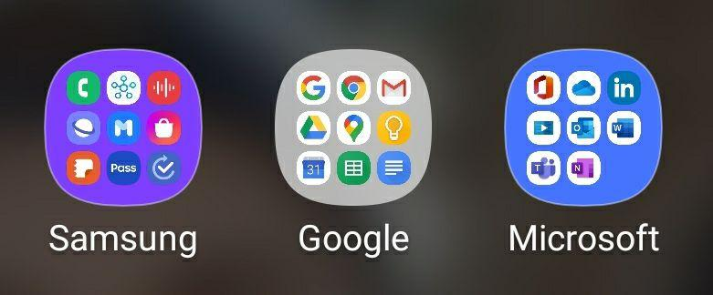

# **[FOSS]** Get rid of tech Giants <!-- omit in toc -->

[time] *min setup*

- [1. Why should we step far from Tech Giants](#1-why-should-we-step-far-from-tech-giants)
  - [Who are they ?](#who-are-they)
  - [Are they *that* bad ?](#are-they-that-bad)
  - [Is there any alternatives ?](#is-there-any-alternatives)
  - [Why you will always need](#why-you-will-always-need)
- [2. Change computer apps](#2-change-computer-apps)
  - [Browser (computer & mobile)](#browser-computer--mobile)
  - [Mail client (computer & mobile)](#mail-client-computer--mobile)
  - [App manager (mobile)](#app-manager-mobile)
  - [SMS (mobile)](#sms-mobile)
- [References](#references)

Catchphrase

In this article, you will see:

- things
- things
- things

## 1. Why should we step far from Tech Giants

### Who are they ?

I call the "Tech Giants" all the companies valuated at more than a billion dollar.
Google, Amazon, Facebook, Apple and Microsoft, often referred as GAFAM, are the companies 

### Are they *that* bad ?

It really is a tough question.

These companies control almost your entire digital life and tend to invade your personal private life as well.

Most of them do not seem so greedy, as they mostly provide free services. The only thing they have is your personal data! But here is their yearly revenue  :

|           | Revenue ($) | Founder/CEO wealth rank  | Ads |
|----------:|:-----------:|:------------------------:|:---:|
|   Google  |     66 B    |  13[^page] & 14[^brin]   | 86% |
|   Amazon  |     280 B   |        1[^bezos]         |     |
|  Facebook |     70 B    |        7[^zuckerberg]    |     |
|   Apple   |     260 B   |      39[^jobs]           |     |
| Microsoft |     125 B   | 2[^gates] / 11[^ballmer] |     |

Surprising, isn't it? Almost

Controlling everything

It is also a matter of not putting all your eggs in the same basket.

To illustrate that, I have regrouped apps on my phone by company. I've counted : more than 38% of my apps are from Google, Microsoft or Samsung! Moreover, my phone is an Android, the *Google* OS for smartphones...

You can do this yourself, it will be the same... If you use an iPhone/iPad, even more of the apps actually belongs to one and only company!

### Is there any alternatives ?

FOSS

Why it's good

It's easy for someone to change (even more if I explain to you how)

Why do people develop FOSS?

### Why you will always need

Popular because it's popular (Whatsapp < Telegram in ùy school)
One can change it's habits but hard for everyone.

Communication should not rely on software or company (.docx open on Google Docs / .md)

Softwares should be a tool for a common protocol : a good example is mail.

## 2. Change computer apps

### Browser (computer & mobile)

Things

### Mail client (computer & mobile)

Things

### App manager (mobile)

Get rid of Google Play

### SMS (mobile)

Free alternative on FDroid

→ [All articles](../articles.md)

## References

[^page]: Larry Page, 2020 (Co-founder) <https://www.forbes.com/profile/larry-page/>
[^brin]: Sergey Brin, 2020 (Co-founder) <https://www.forbes.com/profile/sergey-brin/>
[^bezos]: Jeff Bezos, 2020 (Founder) <https://www.forbes.com/profile/jeff-bezos/>
[^zuckerberg]: Mark Zuckerberg, 2020 (Founder) <https://www.forbes.com/profile/mark-zuckerberg/>
[^jobs]: Steve Jobs, rank in 2011 as he died that year (Founder) <https://www.forbes.com/profile/steve-jobs/>
[^gates]: Bill Gates, 2020 (Founder) <https://www.forbes.com/profile/bill-gates/>
[^ballmer]: Steve Ballmer, 2020 (CEO from 2000 to 2014) <https://www.forbes.com/profile/steve-ballmer/>
