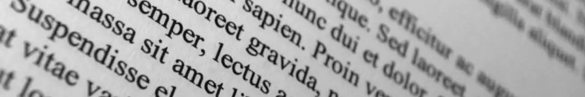

# Learn every month!

## Latest Articles

### **\[Meta\]** [Why you should start a blog now](articles/6-about-blogging.md)

_August 2020_ - My motivations \(and soon yours\) to create a blog

### **\[Maths\]** [Control the opponent in some games](articles/4-strategies-ipd.md)

_June 2020_ - Learn to control your opponent's score in some games.

### **\[Crypto\]** [Sign your commits with PGP](articles/3-pgp.md)

_May 2020_ - Encrypt emails and documents. Sign your git commits. Secure your work.

→ [All articles](articles-1.md)

## Projects

[**Amethysts Studio**](https://amethysts.coalescence-universe.com) : my artistic creations \(short stories and others\)

[**Coalescence**](https://play.google.com/store/apps/details?id=com.coal) : a mysterious visual novel, available on [Google Play](https://play.google.com/store/apps/details?id=com.coal)

→ [Github Profile](https://github.com/EwenQuim/)

## About

Look at my [CV](https://www.linkedin.com/in/ewen-quimerch/)

